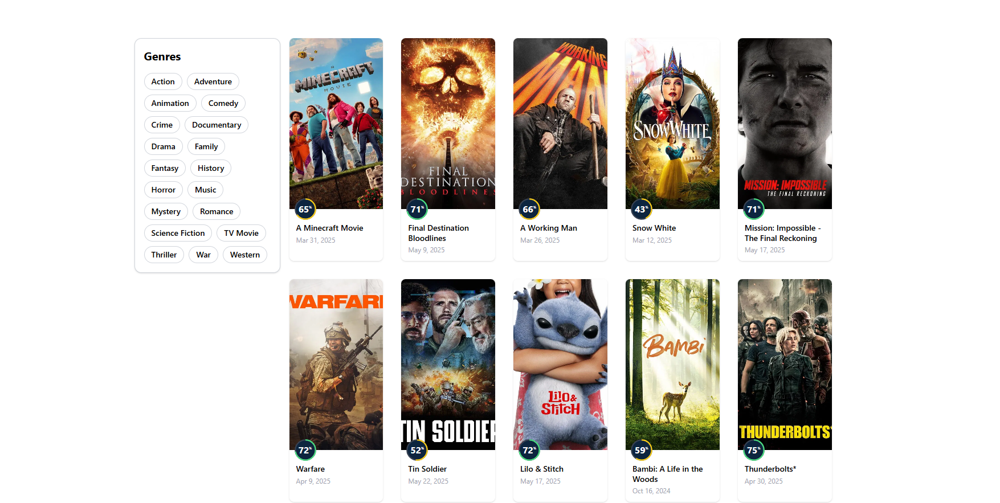

# 📽️ TMDB Movie Browser

A React + TypeScript movie browser built with Vite and TailwindCSS.  
Users can browse popular movies from [The Movie Database (TMDB)](https://www.themoviedb.org/), filter them by genre, and load more results with infinite scroll.

---

## 🚀 Features

- 🎬 Fetches real-time movie data from TMDB API
- 🎯 Genre filtering with dynamic sidebar
- 🔄 Pagination & infinite scroll after first "Load More"

---

## 📸 Screenshot



---

## 🛠️ Built With

- [React](https://react.dev/)
- [TypeScript](https://www.typescriptlang.org/)
- [Vite](https://vitejs.dev/)
- [Tailwind CSS](https://tailwindcss.com/)
- [TMDB API](https://developer.themoviedb.org/)

---

## 📦 Setup

```bash
pnpm install
pnpm dev
